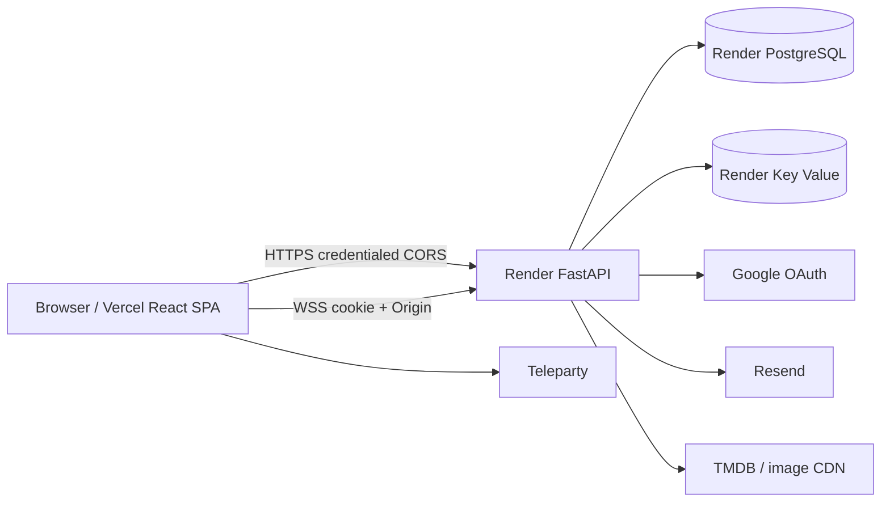

# Arbiter Security Audit - 2026-07-21

Status: remediation complete; production operations remain before public launch.

## 1. Executive summary

The audit found no Critical issue. It confirmed six High issues: production MCP
exposure with unsafe shared-client behavior, missing HTTP Origin enforcement,
replayable magic links, logout that did not revoke copied JWTs, unsafe OAuth
email-only account binding, and known vulnerabilities in production Python
dependencies. All six are remediated and covered by tests or deployment checks.

The application is ready for Phase 4 development, but not for an unrestricted
public launch until the Render Key Value rate-limit service is configured and a
backup restore drill is completed. This is an internal ASVS-oriented review,
not a third-party penetration test or certification.

## 2. Scope and standards

Scope: React/Vite browser app, FastAPI API, PostgreSQL, Redis-compatible rate
limits, WebSockets, Google OAuth, magic links, Resend, TMDB/images, Teleparty,
card export, Vercel, Render, migrations, dependencies, CI, logs, and deletion.

Standards: [OWASP Top 10:2025](https://owasp.org/Top10/2025/),
[OWASP API Security Top 10:2023](https://owasp.org/API-Security/editions/2023/en/0x11-t10/),
[OWASP ASVS 5.0.0](https://owasp.org/www-project-application-security-verification-standard/),
and current official FastAPI, Starlette, Pydantic, SQLAlchemy, Authlib, HTTPX,
asyncpg, browser, Vite, React, and provider documentation. Target: practical
ASVS Level 1 plus selected Level 2 authentication/access controls.

## 3. Architecture and trust boundaries



Browser, frontend, API, database, Key Value, CI/deployment, and every provider
are independent trust boundaries. Client route guards are usability controls;
the API authorizes every private object. Realtime hubs remain process-local.

## 4. Data inventory

| Data | Storage/transit | Access and retention/deletion |
| --- | --- | --- |
| Email | `users`; Google/Resend transit | Self/auth services; removed on account deletion; excluded from social responses/history/cards |
| Username/display/avatar | Users and historical participant snapshots | Public to relevant friends/groups; snapshots intentionally remain intelligible after account deletion |
| Password hash | `users` | Authentication only; bcrypt; deleted with account |
| Auth cookie/JTI | HttpOnly browser cookie + `auth_sessions` | Bearer session; expires/revokes; deleted with account |
| OAuth identity | `oauth_identities` | Provider subject/email server-side only; deleted with account |
| Magic grant | Hashed grant and intent in `magic_link_grants` | One use, short expiry; no raw token stored |
| Friend/group state | PostgreSQL | Involved users/members; cascades on deletion; expired requests cleaned by scheduled command |
| Watchlists/sessions/votes | PostgreSQL + authorized API/WS | Group-private; current records cascade or null creator on deletion |
| Completed history | Snapshot tables | Current group members; public display snapshots retained, user FK may be null; no email/raw vote response |
| Teleparty URL | Active session | Group-private; URL is not copied to durable history/cards/logs |
| Mood/custom text | Session/history | Group-private; durable with history |
| Feedback | Resend, not Arbiter DB | Consented message/contact/diagnostics; provider retention applies |
| IP metadata | HMAC-derived Redis keys/platform logs | Rate-limit window only in app; platform retention external |

## 5. Entry points and route controls

The complete method/path/auth/authorization/rate-limit/response inventory is in
[route-security-matrix.md](route-security-matrix.md). No production admin,
fixture, seed, migration, metrics, OpenAPI, docs, Redoc, or MCP route remains.

## 6. Threat model

Primary threats: cross-user ID substitution, cookie CSRF, stolen/replayed auth
or invite credentials, OAuth account confusion, room subscription abuse,
upstream/API exhaustion, SSRF through artwork, XSS through names/custom text,
private history/card leakage, dependency compromise, and sensitive logging.
Controls use deny-by-default authorization, strict schemas, exact origins/hosts,
database constraints, shared limits, minimal responses, and testable sanitizers.

## 7. Findings and remediation

All findings below are **CONFIRMED** by source tracing, reproduction, or scanner
evidence. Likelihood reflects Arbiter's current deployment and reachable attack
surface, not only theoretical exploitability.

| ID | Severity / likelihood | Evidence, reproduction, and impact | Remediation | Verification / status |
| --- | --- | --- | --- | --- |
| A-00 | High / Medium | Production mounted MCP tooling; its shared synthetic HTTP client retained cookies, allowing one MCP caller's identity to reach another call. | Restrict MCP and its dependency to local/test development. | Production route/config tests; fixed. |
| A-01 | High / High | A foreign-origin credentialed POST could reach logout because unsafe methods did not validate Origin and production supports cross-site cookies. | Exact configured Origin is required before parsing every unsafe request. | Allowed, absent, malformed, `null`, and foreign Origin tests; browser cross-site denial; fixed. |
| A-02 | High / High | The same magic-link JWT could be submitted repeatedly until expiry, and appeared in the query string. Account takeover remains possible after link disclosure. | Store hashed one-time grant and browser intent; carry grant in fragment, strip immediately, verify through JSON POST, consume atomically. | Replay, expiry, intent mismatch, URL cleanup, and concurrent-consume tests; fixed. |
| A-03 | High / Medium | A copied JWT remained valid after the originating browser logged out because logout only cleared its cookie. | Require `jti` and active database session; revoke JTI and close sockets on logout/deletion. | Copied-cookie replay and WebSocket logout tests; fixed. |
| A-04 | High / Medium | Google callback matched users by email without binding immutable provider subject or requiring verified email, risking account confusion. | Bind `provider + sub`, require `email_verified`, and permit a one-time pre-migration link only when Google is authoritative for Gmail or a matching Workspace domain; reject all other collisions. | OAuth state, authoritative bootstrap, identity collision, verified-email, and redirect tests; fixed. |
| A-05 | High / Medium | `pip-audit` initially reported 32 advisories in production auth/request dependencies. | Upgrade deliberately and replace `python-jose`/ECDSA with fixed-algorithm PyJWT. | Final `pip-audit` reports zero known vulnerabilities; fixed. |
| A-06 | Medium / High | Repeated auth, search, social, group, session, and vote calls had no shared sustained control and could exhaust email/provider/DB capacity. | Shared Redis account/IP/subject fixed windows, opaque keys, controlled 429, fail closed in production. | Boundary, separate-user, burst, recovery, failure, and key-secrecy tests; fixed in code, Render KV deployment required. |
| A-07 | Medium / Medium | Production docs, OpenAPI, and MCP disclosed extra callable/schema surface. | Disable all three outside local/test. | Environment route tests; fixed. |
| A-08 | Medium / Medium | Frontend/API responses lacked a consistent CSP, anti-framing, MIME, referrer, permissions, HSTS, and private-cache policy. | Add Vercel and API security-header policies derived from actual resources. | Header unit tests and production-build browser inspection; fixed. |
| A-09 | Medium / Medium | Friend, member, and watchlist responses included account email although UI identity only needs public profile fields. | Explicit public identity response schemas and matching frontend types. | Serialization and frontend tests; browser network inspection; fixed. |
| A-10 | Medium / Medium | History exposed per-participant votes and source watchlist IDs beyond the memory UI's needs. | Remove both from public response models while retaining server-side aggregates. | History schema/API and frontend tests; fixed. |
| A-11 | Medium / Medium | Teleparty accepted HTTP/userinfo and browser destinations used inconsistent checks, enabling unsafe navigation or deceptive URLs. | Require HTTPS, exact hosts, standard ports, and no credentials; centralize client allowlists. | URL matrix and component tests; fixed. |
| A-12 | Medium / Medium | Account-scoped session context remained in localStorage after logout/account switch and could be read by the next account in the same browser. | Delete current and legacy account-scoped keys while retaining non-sensitive preferences. | Unit tests plus logout/Back browser journey; fixed. |
| A-13 | Medium / Medium | Privacy UI described deletion, but no complete tested operation revoked access and reconciled owned/group/history data. | Exact-confirmation endpoint, owner guard, FK cascade/null rules, session/socket revocation, and migrations. | Deletion, migration, ownership, and socket tests; fixed. |
| A-14 | Medium / Medium | TMDB images were buffered before applying the 10 MiB limit, permitting memory pressure. | Stream with cap, disable redirects/encoding, fix upstream host/path/extensions, and allow raster MIME only. | Host, redirect, type, timeout, and oversized stream tests; fixed. |
| A-15 | Medium / Medium | WebSockets lacked per-user connection, inbound frame, queue, and strict-message bounds, permitting worker exhaustion. | Eight connections/user, 4 KiB frames, bounded queues/pings, concurrency limit, exact ping schema. | All-hub cap, malformed message, Origin, auth, and access-loss tests; fixed. |
| A-16 | Low / Medium | Several request models ignored unknown fields, allowing protected-looking input to be accepted even when unused. | Forbid extras and bound security-sensitive schemas, arrays, enums, and numbers. | Mass-assignment and boundary tests; fixed. |
| A-17 | Low / Low | Five committed localhost cookie jars contained expired development JWTs, creating secret-handling drift. | Delete and ignore jars; use a narrow historical path exception after manual classification. | Current-tree scan clean; Gitleaks full-history finding documented; fixed, no production credential found. |
| A-18 | Low / Medium | Uvicorn access logs could persist OAuth callback query codes. | Disable production access logs and keep application logs to path/minimal metadata. | Render command/config review and log tests; fixed. |
| A-19 | Informational / Medium | Realtime fan-out and connection tracking are process-local, so multiple workers would create inconsistent delivery/revocation. | Enforce one worker/instance; require a shared broker before scaling. | Deployment command and runbook; accepted constraint. |

No confirmed SQL injection, dangerous DOM HTML sink, unrestricted remote image
proxy, card privacy leak, wildcard credentialed CORS, arbitrary account room, or
active production credential was found.

## 8. Authentication assessment

Access tokens use fixed HS256, required `sub/jti/iat/exp`, a production secret
minimum, database-backed expiration/revocation, `HttpOnly`, production `Secure`,
configured `SameSite`, host-only domain by default, and path `/`. Login performs
constant password work for unknown users. Logout revokes the current session.
Deployment invalidates pre-migration cookies and requires all users to sign in.

Magic links are one-time and same-browser intent-bound. This intentionally
removes cross-device link completion; a future cross-device flow needs an
explicit confirmation design. Existing pre-migration Gmail and matching
Workspace accounts can bind once from authoritative Google claims, after which
the immutable subject is required. Other existing-email collisions fail closed;
explicit account linking is future work.

## 9. Authorization and data exposure

Group, watchlist, session, history, Insights, artwork, invitations, friendship,
avatar, and owner functions resolve identity from the server session and check
membership/role server-side. Browser substitution returned `403` to a separate
authenticated user and `401` signed out. UUID unpredictability is not relied on.
Explicit response schemas omit email, OAuth fields, token hashes, raw votes,
Teleparty history URLs, and internal source identifiers.

## 10. CSRF, CORS, redirects, and browser boundaries

Unsafe methods require a normalized exact Origin; absent, malformed, `null`,
foreign, and wildcard Origins fail outside local/test. CORS uses exact HTTPS
production origins, credentials, four required methods, and limited headers.
Authentication redirects are configured exact URLs; magic credentials use a
fragment removed synchronously by the frontend. Protocol-relative and unsafe
external navigation is rejected by centralized helpers.

## 11. WebSockets and invitations

Each WebSocket authenticates and validates Origin before accept, derives account
rooms from the cookie, authorizes group/session paths, accepts only exact ping,
caps connections/frames/queues, and closes affected sockets on logout or access
loss. A browser nonmember socket never opened; hub tests verify selective 1008
closure. In-app invitation IDs replaced legacy bearer links/codes and direct
membership addition. Pending uniqueness and transactional decisions remain.

## 12. Input, injection, URL, and external-resource assessment

Pydantic schemas bound strings, arrays, numeric ranges, enums, IDs, and unknown
fields. SQLAlchemy queries are parameterized; dynamic behavior is allowlisted.
No `dangerouslySetInnerHTML`, `innerHTML`, `eval`, or `new Function` sink exists
in application source. XSS-style group text rendered inert as text. Teleparty
and client external URLs use HTTPS exact host allowlists.

TMDB artwork is not an arbitrary URL proxy: group/candidate authorization,
known snapshot paths, extension checks, fixed upstream host, redirect refusal,
timeouts, MIME checks, and a streamed 10 MiB limit apply. Third-party errors are
mapped to generic client messages.

## 13. Card export privacy

The final typed sanitizer excludes names, avatars, handles, emails, votes,
tokens, internal IDs, invite/private URLs, and Teleparty URLs independent of UI
visibility. Browser validation exported all three templates in square and
portrait: exact 1080x1080 and 1080x1920, no forbidden creator state, and no
author/comment/source metadata. Object URLs and canvas bounds remain controlled
by existing export cleanup and fixed dimensions.

## 14. Headers, resource controls, database, and errors

Vercel enforces a resource-derived CSP without `unsafe-eval`, HSTS, nosniff,
strict-origin-when-cross-origin, camera/microphone/geolocation denial, and frame
denial. API responses add restrictive CSP/frame/referrer/permissions/nosniff,
private no-store, and production HSTS. CSP changes require provider review.

Production Postgres requires TLS, bounded pool/overflow/wait, 30-second command
and statement timeouts, foreign keys, uniqueness constraints, and transactional
state transitions. Application responses omit provider/SQL/stack details. Logs
exclude payloads, tokens, emails, private URLs, and provider response bodies.

## 15. Dependency, secret, static, and dynamic scans

- `npm audit`: 0 vulnerabilities across 518 packages.
- `pip-audit -r requirements.txt`: 0 known vulnerabilities after remediation.
- Bandit: 0 Medium/High; 14 Low (deterministic product shuffles and best-effort
  closed-socket cleanup, manually classified non-security).
- Gitleaks: frontend 82 commits clean; backend 62 commits clean after a narrow
  exception for removed localhost cookie filenames. Initial seven hits were the
  expired local JWTs described in A-17.
- detect-secrets/manual review: no active production credential confirmed.
- Trivy configuration scan: no supported deploy file detected; result is
  inconclusive, not a clean-container claim.
- ZAP passive baseline against isolated local API: 65 checks passed, 0 failures,
  two reviewed warnings: intentional non-storable responses and absent CORP.
  CORP was not added because the credentialed API and frontend use different
  sites; CORS/CSP/auth remain the applicable controls.

## 16. Tests, commands, and browser journeys

Primary commands:

```text
npm audit --audit-level=high
npm run lint
npm test
npm run build
pip-audit -r requirements.txt
bandit -q -ll -r app -x tests
ruff check app tests scripts alembic
pytest -q
alembic upgrade head / downgrade / upgrade / current
gitleaks detect --redact (both Git histories)
trivy config --severity HIGH,CRITICAL
zap-baseline.py against isolated local API
```

Final automated results: backend 267 tests including connection-cap,
authenticated-mutation-limit, and legacy Google identity-binding coverage;
frontend 84 tests; ESLint, TypeScript, Vite production build, Ruff, migration
head, audits, and relevant static scans pass. The exact rerun evidence is also
reported in the implementation closeout; warnings are not represented as pass.

Playwright used isolated User A, User B, and signed-out contexts. It verified
distinct identities/cookies, cross-user group/watchlist/history/Insights denial,
nonmember WebSocket rejection, inert user text, logout and Back behavior,
storage cleanup, six card exports/privacy/dimensions, keyboard radio operation,
and 390x844 no horizontal overflow. Native OAuth/email-provider and production
WSS were not exercised against live providers.

## 17. CI and production configuration

Each Git repository now has least-privilege CI for dependency audit, lint/static
analysis, tests, build/migrations, and full-history Gitleaks. Production requires:
`DATABASE_URL`, `JWT_SECRET`, `OAUTH_SESSION_SECRET`, exact `CORS_ORIGINS`, exact
OAuth URLs/credentials, `TMDB_TOKEN`, Resend values where enabled, feedback
sender/recipient flags, and `RATE_LIMIT_REDIS_URL`. Secrets remain backend-only.

## 18. Deferred and residual risks

1. Configure same-region Render Key Value and verify `429` behavior before public
   launch; production abuse-sensitive routes intentionally fail closed without it.
2. Complete an isolated Render Postgres restore drill and document retention.
3. Add a shared realtime broker before any second worker/instance.
4. Add explicit Google linking for non-authoritative third-party email domains
   and a deliberate cross-device magic-link flow; current behavior fails closed.
5. Add centralized structured security-event monitoring before high traffic.
6. Perform an independent authenticated penetration test before materially
   sensitive or high-volume use. ZAP coverage here was passive and local.
7. Registration necessarily reports identifier collision; magic request/login
   remain enumeration-resistant. Revisit public registration policy if abuse grows.
8. PostgreSQL TLS uses encryption (`require`) rather than hostname/CA
   verification; move to `verify-full` if Render supplies a stable CA workflow.

## 19. Manual production checks and readiness

Before public launch: provision Render Key Value, set its internal URL, confirm
one instance/worker, run migrations, verify docs/MCP/local bypass return 404,
inspect real Vercel/API headers, test Google and magic-link login/logout once,
confirm no access logs contain OAuth codes, perform backup restore, and monitor
rate-limit/origin failures. Existing sessions will be signed out by the new JTI
model, and outstanding pre-migration magic links will no longer verify.

Recommendation: **ready for Phase 4 development; conditionally ready for public
launch only after the operational items above.** Use
[feature-security-checklist.md](feature-security-checklist.md) for Annual Recap
and [production-operations.md](production-operations.md) for deployment.
